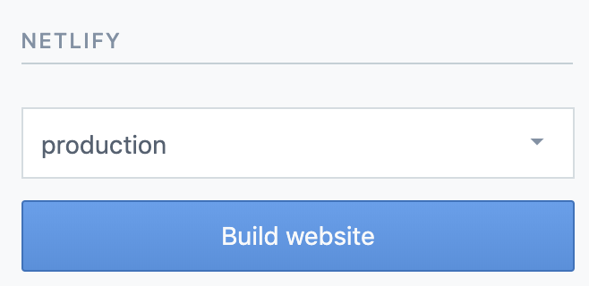

# www

`www` is the repo for the [marketing site](https://www.aptible.com), hosted
on [Netlify](https://www.netlify.com).

## Running locally

First, create a `.env.development` file with the contentful preview credentials:

```
CONTENTFUL_HOST=preview.contentful.com
CONTENTFUL_ACCESS_TOKEN=
CONTENTFUL_SPACE_ID=
```

Then install dependencies and start:

```
yarn
gatsby develop
```

Sometimes changes you make in Contentful won't show up locally because Gatsby
caches the data. To clear the cache, delete the `.cache` directory.

## GraphQL Contentful Restrictions

When working with contentful, there is an important caveat on the
[gatsby-source-contentful documentation](https://www.gatsbyjs.com/plugins/gatsby-source-contentful/#restrictions-and-limitations):

> At the moment, fields that do not have at least one populated instance will
> not be created in the GraphQL schema. This can break your site when field values
> get removed. You may workaround with an extra content entry with all fields filled out.

What this means is if we query for "author" on blog posts but our author value
for all blogs posts being returned are `null` or empty, then we have have a
build-time error that will prevent us from building the app locally.

## Deploying

All commits to `master` will get deployed automatically to the staging site:

[http://aptible-staging.netlify.com/](http://aptible-staging.netlify.com/)
(password `aptible2019`)

Additionally, every PR will get its own preview build in a staging environment
(the password for PR previews is also `aptible2019`).

**To deploy to production,** after your PR has been merged, push your changes
from `master` to `release`, and Netlify will build and deploy the site
automatically.

```
git push upstream master:release
```

Deploys currently take ~5 mins.

## Adding or editing Contentful entries (blog posts, changelog, resources, etc.)

Login to Contentful using the shared credentials in 1Password, and make sure
you are in the `www.aptible.com` workspace in the top left of the screen.

You can then add or edit content entries. Any changes you make will _not_ be
visible in production until you `Publish` them - before that, they will only be
visible locally and on staging / PR preview sites.

Once you publish your changes, you need to re-build the site in order for them
to be visible.

The sites (production and staging) can be built directly in Contentful, using
this button on the right side of the screen when editing content:



Builds can also be kicked off from the Netlify UI, or by pushing changes to
the `release` branch in Github.
